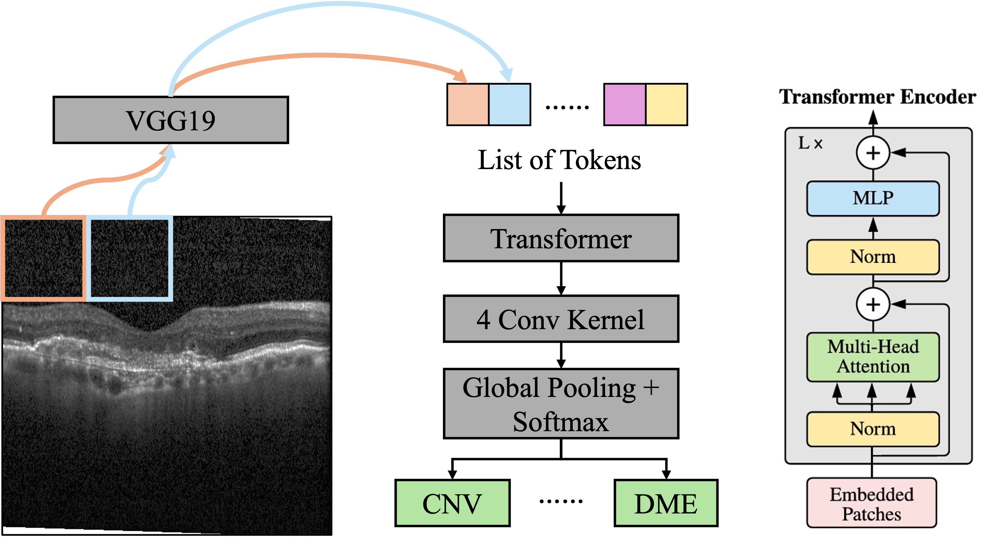

# Explainable Prediction of Retina Phenotype through AttnMIL
This is the course project for BMI707: Deep Learning for Biomedical Data at Harvard Medical School. This project utilizes the Attention-guided Multiple Instance Learning (AttnMIL) model to classify the retina damages from the Optical Coherent Tomography (OCT) images in [Kermany et al., 2018](https://doi.org/10.1016/j.cell.2018.02.010).

AttnMIL uses pre-trained CNN to embed patches of the image, attention for capture the internal relationship, and Multiple Instance Learning for classification.

# References
+ Arnab, A., Dehghani, M., Heigold, G., Sun, C., Lučić, M., & Schmid, C. (2021). ViViT: A Video Vision Transformer. arXiv [cs.CV]. http://arxiv.org/abs/2103.15691

+ Kermany, D. S., Goldbaum, M., Cai, W., Valentim, C. C. S., Liang, H., Baxter, S. L., McKeown, A., Yang, G., Wu, X., Yan, F., Dong, J., Prasadha, M. K., Pei, J., Ting, M. Y. L., Zhu, J., Li, C., Hewett, S., Dong, J., Ziyar, I., . . . Zhang, K. (2018). Identifying Medical Diagnoses and Treatable Diseases by Image-Based Deep Learning. Cell, 172(5), 1122-1131.e1129. https://doi.org/10.1016/j.cell.2018.02.010 

+ Lu, M.Y., Chen, T.Y., Williamson, D.F.K. et al. AI-based pathology predicts origins for cancers of unknown primary. Nature 594, 106–110 (2021). https://doi.org/10.1038/s41586-021-03512-4

+ Yao, Jiawen, et al. ‘Whole Slide Images Based Cancer Survival Prediction Using Attention Guided Deep Multiple Instance Learning Networks’. Medical Image Analysis, vol. 65, Elsevier BV, Oct. 2020, p. 101789, https://doi.org10.1016/j.media.2020.101789.